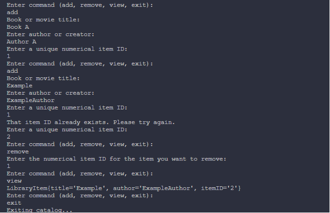

# A Java Generics Library Platform

## Table of Contents

- [Introduction](#introduction)
- [Prerequisites](#prerequisites)
- [Installation](#installation)
- [Usage](#usage)
- [Contributing](#contributing)
- [License](#license)

## Introduction

This project is a Java Generics Library Platform designed to provide reusable and type-safe generic data structures and utilities. It aims to simplify the development of Java applications by offering a robust library of generic classes and methods.

## Prerequisites

Before you begin, ensure you have the following:

- Java Development Kit (JDK) version 8 or higher installed.
- An IDE (e.g., IntelliJ IDEA, Eclipse, Visual Studio Code) for development.

## Installation

1. Clone the repository:

```sh
git clone https://github.com/yourusername/A-Java-Generics-Library-Platform.git
```

2. Navigate to the project directory:

```sh
cd A-Java-Generics-Library-Platform
```

3. Build the project using your preferred IDE or a build tool like Maven or Gradle.

## Usage

1. After the program has started, you will be prompted, to enter any of these four commands: add, remove, view, exit

a. The 'add' command will prompt you for details on the book or movie you want to add into the library database.
b. The 'remove' command will prompt you for the unique ID of the library item that you wish to remove from the database.
c. 'view' lets you view the list of items in the library.
d. 'exit' will exit the program.

2. Upon choosing to add an item, the program will ask for the name of the item, it's author, and a unique ID for the item in case there are similar duplicate items like it.

## Example:



### Code Structure

Once the repository is downloaded, you will want to ensure that these files are already present:

```
.
├── Catalog.java
│
├── LibraryItem.java
│
├── Main.java
|
└── Testing.java
```

## Contributing

Feel free to contribute! To contribute:

1. Fork the repository.
2. Create a new branch (`git checkout -b feature-branch`).
3. Make your changes.
4. Commit your changes (`git commit -m 'Add new feature'`).
5. Push to the branch (`git push origin feature-branch`).
6. Open a pull request.

## License

This project is licensed under the MIT License. See the [LICENSE](LICENSE) file for details.
